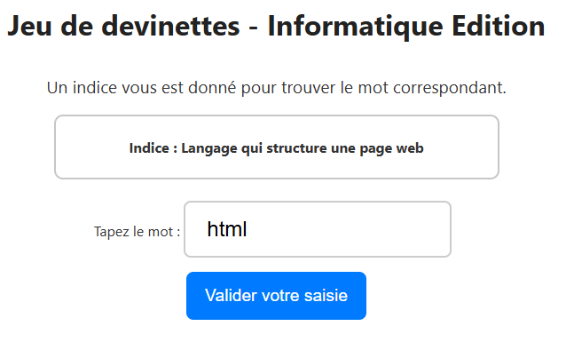

# 🎮 Jeu de devinettes - Informatique Edition

Bienvenue dans mon projet HTML/CSS/JavaScript 🎉  
Un petit jeu en JavaScript où l'utilisateur doit deviner un mot en lien avec l'informatique grâce à un indice.  
Ce projet a pour but de pratiquer le JavaScript, la manipulation du DOM et l’interaction utilisateur.

---

## 🛠️ Fonctionnalités

- Affichage aléatoire d’un mot à deviner accompagné d’un indice.
- Champ de saisie pour entrer la réponse.
- Bouton de validation qui indique si la réponse est correcte ou non.
- Alertes de victoire ou d’erreur.

---

## 🔍 Aperçu du projet

  

---

## 📁 Arborescence du projet

├── index.html
├── style.css
├── script.js
├── README.md
└── screen-devinette.png

---

## 🚀 Comment l’utiliser

1. Clone ou télécharge ce repo  
2. Ouvre `index.html` dans ton navigateur  
3. Joue ! 

---

## ✅ Exemple d’utilisation

> Indice affiché : “Langage qui structure une page web”  
> Saisie : `html` → ✅ Bravo !
> Rechargez la page pour avoir un autre mot à deviner
> Recommencez !

---

## 📦 Tech utilisées

- HTML5
- CSS3
- JavaScript

---

## ✨ Idées d'amélioration

- [ ] 🧩 Gérer plusieurs tentatives et afficher le nombre d’essais.
- [ ] 💬 Ajouter un retour visuel dans la page au lieu des `alert()`.
- [ ] 🎯 Ajouter un score ou un système de points.
- [ ] 📚 Ajouter plusieurs catégories de mots (ex : langages, outils, concepts).
- [ ] ⌛ Ajouter une minuterie pour rendre le jeu plus challengeant.
- [ ] 📱 Rendre le jeu responsive pour mobile et tablette.
- [ ] 🔁 Relancer automatiquement une nouvelle devinette après chaque bonne réponse.

---

## 👩‍💻 Auteur

**Léa**  
Développeuse alternante passionnée ✨  

---

## 📄 Licence

Projet open source — fais-en ce que tu veux !  
(mais mentionne l’autrice 🌟)

---
